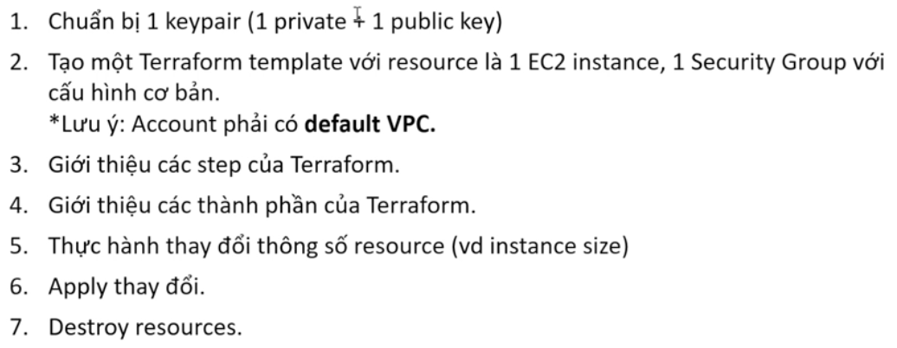

# Sec03

## Lab01

    
     

## Lab02

    
     

- **B1:** 
    - **`cd .../sec03_terraform/lab02`** 
    - **`ssh-keygen -t rsa -b 4096 -C "laikhanhhoang3011@gmail.com"`** $\rightarrow$ `#Path for key: ./keypair/udemy-devops-sec03-lab02-key`
- **B2-3-4:**
    - **`terraform init`**
    - **`terraform plan`**
    - **`terraform apply`**
- **B5-6:**
    - Thực hiện thay đổi `ami` của **resource "aws_instance" "lab-instance"**
    - Sau đó chạy **`terraform apply`** để xem các hành động sẽ được thực hiện, sẽ thấy thông báo **`-/+` (destroy and replacement)** tạo instance mới - mất dữ liệu ổ đĩa gốc và thay đổi địa chỉ Public IP. 
    - Do đó cần đọc kĩ các thông báo **`-/+`** trong Production.
- **B7:**
    - **`terraform destroy`**