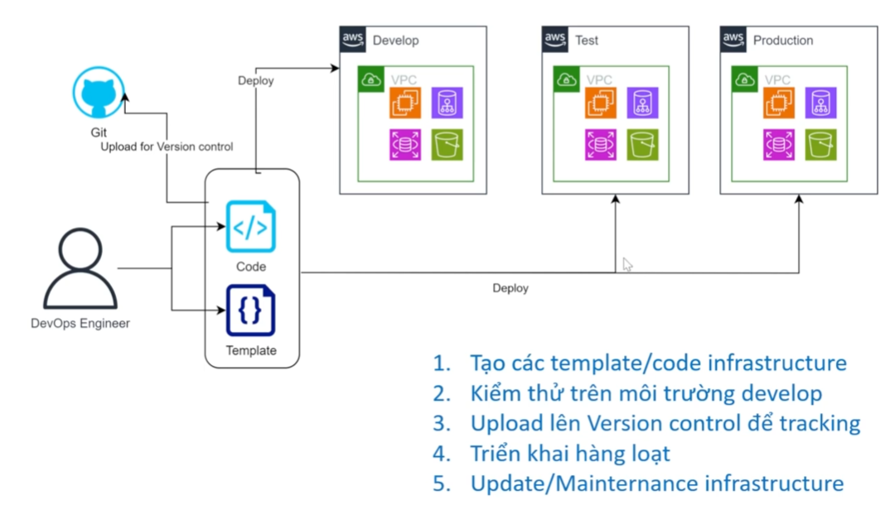
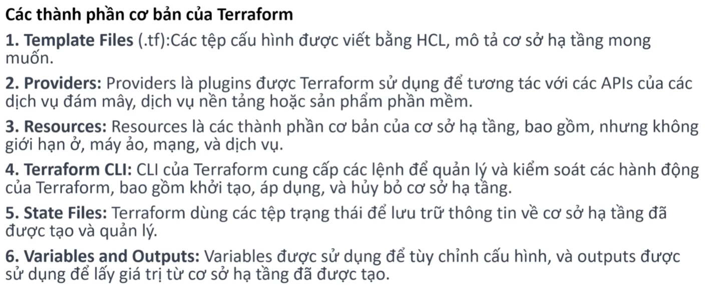

# Sec03: Terraform - Infrastructure as Code (IaC)

## 1.Infrastructure as Code
### 1.1. Định nghĩa Infrastructure as Code (IaC)

**Infrastructure as Code (IaC)** là phương pháp quản lý và cung cấp hạ tầng CNTT thông qua các tệp tin cấu hình (mã nguồn) thay vì thực hiện các thao tác cấu hình thủ công hoặc sử dụng các công cụ tương tác trực tiếp trên giao diện.

*   **Cơ chế hoạt động:** Thay vì thiết lập trực tiếp trên server hoặc giao diện Web (UI), người quản trị sử dụng mã nguồn (Scripts như Python/Bash hoặc Templates như YAML/JSON) để tự động hóa quy trình khởi tạo và cấu hình hệ thống.

*   **Các vấn đề của triển khai truyền thống mà IaC giải quyết:**
    *   **Tốc độ triển khai chậm (Slow Deployment):** Loại bỏ việc lặp lại các bước cài đặt thủ công tốn thời gian.
    *   **Sự thiếu nhất quán (Inconsistency/Configuration Drift):** Loại bỏ tình trạng sai lệch cấu hình giữa các môi trường (Dev, Staging, Production) do sai sót của con người hoặc sự khác biệt về trình độ của người thực thi.
    *   **Khó tái sử dụng (Lack of Reusability):** IaC cho phép nhân bản hạ tầng (Cloning) sang các vùng (Regions) hoặc dự án khác một cách nhanh chóng chỉ bằng cách thực thi lại mã nguồn.
    *   **Khó kiểm soát (Version Control):** Hạ tầng giờ đây có thể được quản lý bằng Git, giúp theo dõi lịch sử thay đổi (ai sửa, sửa gì, khi nào) một cách minh bạch.

### 1.2. Ưu điểm
- **Tự động hóa**: giúp giảm thiểu rủi ro và tăng tốc độ triển khai.
- **Nhất quán và dễ dàng kiểm soát**:
    - Đảm bảo rằng môi trường được cấu hình một cách nhất quán và đúng đắn.
    - Kiểm soát phiên bản cho phép quản lý, theo dõi và phục hồi phiên bản cấu hình.
- **Tích hợp và Phối hợp**:
    - **Tích hợp với DevOps** tạo điều kiện cho việc phát triển và vận hành liền mạch.
    - Phối hợp với các công cụ khác: Dễ dàng tích hợp và phối hợp với các công cụ và dịch vụ khác như CI/CD, monitor, và log.
- **Tối ưu hoá tài nguyên và chi phí**: Thông qua việc **tái sử dụng**, giảm bớt công sức và thời gian của đội ngũ kỹ sư và nhân viên IT, giúp tiết kiệm chi phí.
- **An toàn và Bảo mật**:
    - Quản lý quyền truy cập: Dễ dàng quản lý và kiểm soát quyền truy cập.
    - Tích hợp bảo mật: Có thể tích hợp các chuẩn và quy tắc bảo mật vào trong quá trình cấu hình và triển khai.

### 1.3. Các bước triển khai IaC

    
     
    <i>Version Control ở đây là Github/GitLab. Ta có thể trao cho các <b>Verson Control Software quyền IAM</b>  để <b>update resource</b></i>

## 2. Terraform
### 2.1. Cơ chế hoạt động của Terraform

-   **Khởi tạo (Init) - `terraform init`**: Terraform thực hiện **tải các Plugins/Providers** cần thiết và **thiết lập thư mục làm việc** để sẵn sàng kết nối với Cloud.
-   **Kế hoạch (Plan) - `terraform plan`**: Terraform lấy code bạn viết **so sánh với trạng thái thực tế** $\rightarrow$ **Tạo bản kế hoạch** những gì sẽ được **thêm, sửa, hoặc xóa**.
-   **Thực thi (Apply) - `terraform apply`**: Terraform gửi các yêu cầu đến **API của nhà cung cấp Cloud** $\rightarrow$ **Triển khai hạ tầng** đúng như bản kế hoạch đã phê duyệt.
    -   **Lưu trữ (State) - `.tfstate`**: Terraform tự động **ghi nhớ thông số hạ tầng** vào tệp trạng thái $\rightarrow$ Làm căn cứ duy nhất để **đối chiếu và quản lý** cho các lần thay đổi sau.
-   **Hủy bỏ (Destroy) - `terraform destroy`**: Terraform đối chiếu tệp State để **xác định các tài nguyên** hiện có $\rightarrow$ **Xóa bỏ toàn bộ hạ tầng** đã được quản lý bởi cấu hình đó.

**Luồng xử lý (Workflow) đầy đủ:**

$\text{Write Code} \rightarrow \text{init} \rightarrow \text{plan} \rightarrow \text{apply} \rightarrow \text{Managed Infrastructure} \rightarrow \text{destroy}$

### 2.2. Thành phần cơ bản của Terraform

    
     

